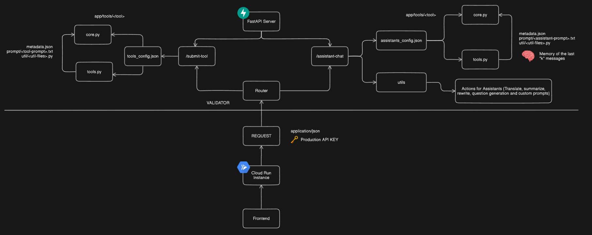

# Marvel AI Platform


## Table of Contents

- [Architecture](#Architecture)
- [Folder Structure](#folder-structure)
- [Setup](#Setup)
- [Local Development](#local-development)
- [Contributing](#Contributing)


## Folder Structure
```plaintext
backend/
├── app/                     # Contains the main application code
│   ├── Api/                 # Contains the API router for handling requests
│   │   └── router.py        # Endpoints for FastAPI to test features and handle incoming requests
│   ├── chats/               # Handles chat functionalities
│   ├── Features/            # Contains feature-specific modules
│   │   ├── Feature1/
│   │   │   ├── core.py
│   │   │   ├── tools.py
│   │   │   ├── Prompt/
│   │   │   └── metadata.json
│   │   ├── Feature2/
│   │   │   ├── core.py
│   │   │   ├── tools.py
│   │   │   ├── Prompt/
│   │   │   └── metadata.json
│   ├── services/            # Contains service modules
│   ├── utils/               # Contains utility modules
│   ├── app.yaml             # Application configuration file
│   ├── Dependencies.py      # Dependency management
│   ├── Main.py              # Main entry point for the application
│   └── requirements.txt     # Python dependencies
├── Dockerfile               # Dockerfile for containerizing the application
└── README.md                # Documentation file
```
## Install all the necessary libraries:

### Navigate to the app directory
```bash
cd backend/app
```

### Create and activate Virtual Environment
```bash
python -m venv env
source env/bin/activate
```

```bash
pip install -r requirements.txt
```
## To Run Locally and Test 

## Prerequisites

- A Google Cloud account.
- Access to the Google Cloud Platform console.

## Steps for Authentication Setup

### Step 1: Create a Service Account

1. Navigate to the [Google Cloud Console](https://console.cloud.google.com/).
2. Go to **IAM & Admin** > **Service Accounts**.
3. Click **Create Service Account**.
4. Enter a name and description for the service account.
5. Click **Create**.
6. Assign the necessary roles to the service account (e.g., Editor, Viewer).
7. Click **Continue** and then **Done** to finish creating the service account.

### Step 2: Download the Service Account Key

1. In the **Service Accounts** page, click on the newly created service account.
2. Go to the **Keys** tab.
3. Click **Add Key**, then select **Create new key**.
4. Choose **JSON** as the key type and click **Create**.
5. The key will be downloaded automatically. Save this file securely.

### Step 3: Rename and Store the Key

1. Rename the downloaded JSON key to `local-auth.json`.
2. Move or copy this file to your application's directory, specifically inside the `/app` directory.

### Step 4: Utilize Local Start Script

1. Modify the `local-start.sh` script's environment variable `PROJECT_ID` to match the project ID of your Google Cloud project.
2. Run the script: `./local-start.sh`
3. Navigate to `http://localhost:8000` to view the application.

# Docker Setup Guide

## Overview

This guide is designed to help contributors set up and run the backend service using Docker. Follow these steps to ensure that your development environment is configured correctly.

NOTE: if you choose to authenticate Google Cloud through the SDK and not with a local serice account key, you must comment out `GOOGLE_APPLICATION_CREDENTIALS` in the Dockerfile.

## Prerequisites

Before you start, ensure you have the following installed:
- Docker
- Python


## Installation Instructions

### 1. Setting Up Local Credentials
Obtain a local-auth.json file which contains the Google service account credentials and place it in the root of the app/ directory within your project.

### 2. Build the Docker Image
Navigate to the project's root directory and build the Docker image:
``` Bash
docker build -t kai-backend:latest .
```
### 3 Run the Docker Container

Run the Docker container using the following command:
``` bash
docker run -p 8000:8000 kai-backend:latest
```
This command starts a detached container that maps port 8000 of the container to port 8000 on the host.

## Environment Variables
The Docker container uses several key environment variables:

-  GOOGLE_APPLICATION_CREDENTIALS points to /app/local-auth.json.
-  ENV_TYPE set to "sandbox" for development.
- PROJECT_ID specifies your Google Cloud project ID.
- LangChain API integration is configured via:
`LANGCHAIN_TRACING_V2`
`LANGCHAIN_ENDPOINT`
`LANGCHAIN_API_KEY`
`LANGCHAIN_PROJECT`
- Ensure these variables are correctly configured in your Dockerfile or passed as additional parameters to your Docker run command, as shown in the example below:
  ```bash
  docker run --env ENV_TYPE=dev --env="Enter your project ID here" -p 8000:8000 kai-backend:latest 
  ```
## Accessing the Application
You can access the backend by visiting:
```Bash
http://localhost:8000

```

After your container starts, you should see the FastAPI landing page, indicating that the application is running successfully.